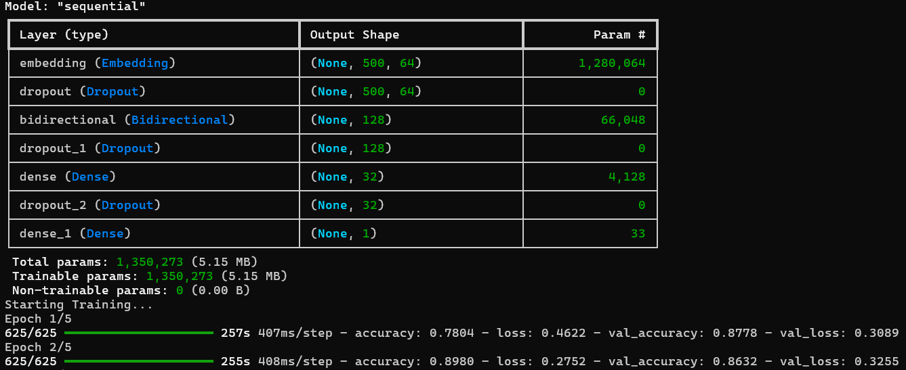

# Review Classifier

A sentiment analysis project that classifies movie reviews (specifically from the IMDB dataset) as positive or negative using a Bidirectional LSTM model with TensorFlow/Keras.

## Project Structure

- **`classifier.py`**: Data loading and preprocessing utilities (regex cleaning, encoding).
- **`training.py`**: Script to train the model. It handles text vectorization, model building (Embedding + Bidirectional LSTM), training, and saving the model & tokenizer.
- **`testing.py`**: script to load the trained model and tokenizer to run predictions on input text.
- **`dataset/`**: Directory containing the `IMDB Dataset.csv`.
- **`model/`**: Directory where `classifier.keras` and `tokenizer.pkl` are saved.

## Setup

1.  **Clone the repository** (if applicable) or navigate to the project directory.
2.  **Create a virtual environment** (optional but recommended):
    ```bash
    python -m venv .venv
    # Windows
    .venv\Scripts\activate
    # Mac/Linux
    source .venv/bin/activate
    ```
3.  **Install dependencies**:
    ```bash
    pip install tensorflow pandas numpy scikit-learn
    ```
    *(Or install via `uv`/`pip` based on `pyproject.toml`)*

## Usage

### 1. Training the Model

To train the model and save the artifacts:

```bash
python training.py
```

This will:
- Load the IMDB dataset.
- Preprocess reviews.
- Train the Bidirectional LSTM model.
- Save the model to `./model/classifier.keras` and tokenizer to `./model/tokenizer.pkl`.

### 2. Testing / Prediction

To predict the sentiment of a review:

```bash
python testing.py
```

You can modify the input text in `testing.py` to test different reviews.




